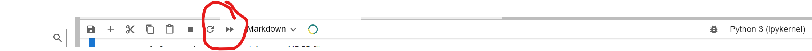
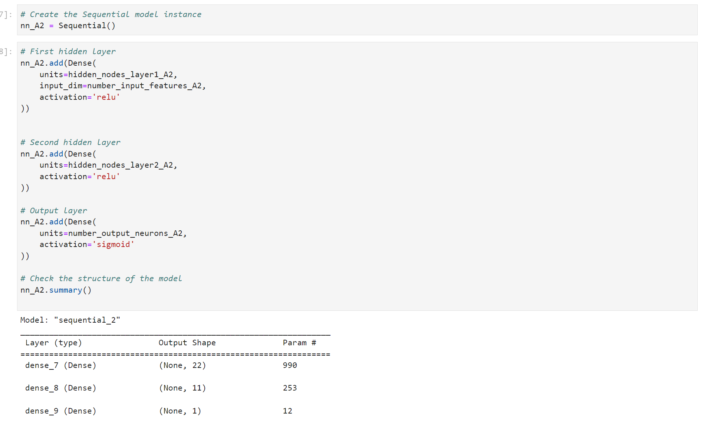

# Predicting_Success
Takes data from over 34,000 businesses and develops a neural network that predicts whether or not a business will be successful. 3 other alternative neural networks with varying accuracy scores are created to try and optimize prediction capabilities. All 4 neural networks are saved locally for later use.

Currently under construction...


---

## Technologies

Language: Python 3.9.12

Libraries used:

[Pandas](https://pandas.pydata.org/pandas-docs/stable/index.html) - For the creation and visualization of Data Frames

[Jupyter Labs](https://jupyter.org/) - An ipython kernel for interactive computing in python

[Scikit-Learn](https://scikit-learn.org/0.18/auto_examples/svm/plot_iris.html) - Powerful machine learning library

[Tensor Flow](https://www.tensorflow.org/) - Machine learning platform for production ready applications

[Keras](https://keras.io/about/) - Built on-top of Tensor Flow, a powerful deep-learning API


---

## Installation Guide

If you are using an anaconda or a conda environment (which is highly recommended) chances are pandas, hvplot and jupyter labs are already installed in your virtual environment. In addition, installing Facebook's Prophet library will be necessary

For a full install activate a conda development environment and run in GitBash if not already installed, otherwise pip can be used:
```python
    conda install pandas
    conda install jupyterlab
```

To install the other dependencies not included in the anaconda environment run:
```python
    conda conda install scikit-learn
    pip install --upgrade tensorflow
```

Check the to make sure everything has been installed properly
```python
    conda list pandas
    conda list jupyter lab
    conda list scikit-learn
    
    python -c "import tensorflow as tf;print(tf.__version__)"
    python -c "import tensorflow as tf;print(tf.keras.__version__)"
```

---

## Usage

To run this jupyter lab notebook you will need to use GitBash and navigate to where you have exported the files associated with this project and activate your dev environment.
Initiate jupyter lab on a local server by  using the command:

```python
    conda activate 'your-dev-environment'
    jupyter lab
```

Next, this project can be ran by navigating to the **credit_risk_resampling.ipynb** jupyter notebook file and clicking the double arrow as seen below:



This will run the jupyter notebook and each cell has pseudocode instructing the viewer as to what is happening. Additionally, the markdown cells provide clues to the viewer as to what the purpose of the different sections of this project entail.

First, a single layered neural network is created with two hidden layers, using the equation **(number_input_features + number_output_neruons) // 2** for the first layer and **(hidden_node_layerl + number_output_neurons) // 2** for the second layer. Next, a sequential neural network is trained on the venture capital data obtained from Google to try and predict whether or not certain businesses will be successful. This first model is analyzed for accuracy and loss. 3 more neural networks are created to try and optimize the loss and accuracy for predicting business success. The first alternate model uses 3 hidden layers to try and predict success. The Second alternate model drops some of the feature columns from the training data set that may potentially confuse a neural network. The third alternate model adds more neurons to the first two hidden layers of the original model.

All 3 alternate models are compared to the original shallower model for accuracy and loss scores to see if changing some of the parameters improved prediction abilites of the models.

The models are all stored locally as json objects with their weights stored in the h5 format for future use as well.


> **Running this notebook takes about 5-10 minutes to complete as 4 different neural networks are fit with 50 epochs each**


---

## Highlights:

### Creation of the Sequential Neural Network



### Training

### Accuracy and Loss


---

## Contributors

Created by Silvano Ross while in the UW FinTech Bootcamp
> Contact Info:
> email: silvanoross3@gmail.com |
> [GitHub](https://github.com/silvanoross) |
> [LinkedIn](https://www.linkedin.com/in/silvano-ross-b6a15a93/)


---

## License

- [MIT](LICENSE)
